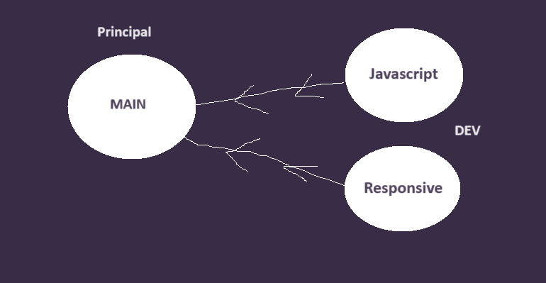

# Projet Antoru

Bienvenue dans Antoru, votre destination ultime pour explorer le monde infini des nouilles !

# Apercu

    - Explication de l'arrivée des nouilles dans le monde.
    - Kit pour préparer des nouilles a la perfection.
    - Les diférents types de nouilles

# Le procédé

# Les branches

    -  `#1589F0`

# Comment démarrer

- git clone https://github.com/RubenLawen/TP2_Ruben_Tom_Anas.git

- cd TP2_Ruben_Tom_Anas.git

- Utiliser l'extension Live server et démarer le projet avec. (http://localhost:3000)

# Technologies utilisées

Html
Css
JavaScript
NodeJs (commitizen)
